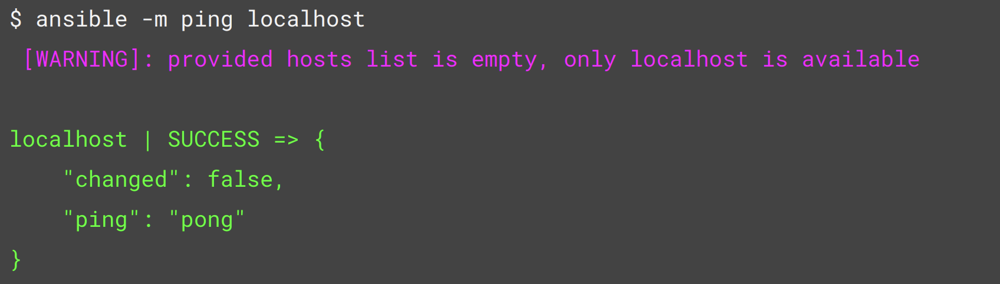

# Lab2: Install Ansible

## Installing Ansible on Fedora Linux

Fedora Linux provides both the full Ansible package and the minimal ansible-core package through the standard repositories.

Install the full ansible package:

```
sudo dnf install ansible
```

Install the minimal ansible-core package:

```
sudo dnf install ansible-core
```

Fedora repositories include several Ansible collections as standalone packages that you can install alongside ansible-core. For example, install the community.general collection:

```
sudo dnf install ansible-collection-community-general
```

## Installing Ansible on Ubuntu

Ubuntu provides Ansible packages through a Personal Package Archive (PPA) that contains more recent versions than the standard repositories.

Ubuntu builds are available in a [PPA here](https://launchpad.net/~ansible/+archive/ubuntu/ansible).

Configure the PPA on your system and install Ansible:

```
$ sudo apt update
$ sudo apt install software-properties-common
$ sudo add-apt-repository --yes --update ppa:ansible/ansible
$ sudo apt install ansible
```

## To verify that Ansible is installed correctly on your system

```
# Check the installed Ansible version
ansible --version

#Verify Ansible connectivity using the ping module
ansible -m ping localhost
```



## Reference

1. Ansible, "Installing Ansible on specific operating systems", https://docs.ansible.com/projects/ansible/latest/installation_guide/installation_distros.html
