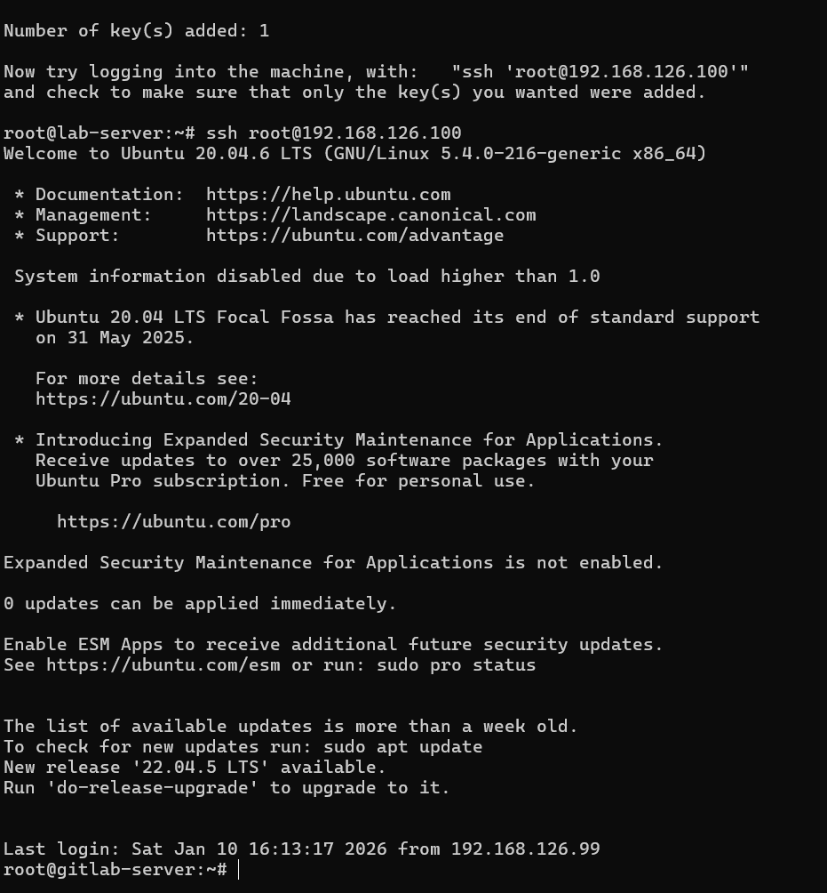
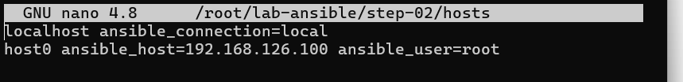
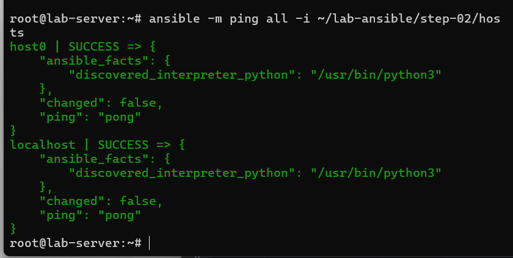

# Ansible: Inventory

## Prerequisites

- 1 VM or local machine to act as the Ansible control node
- 2 VM to act as a managed node




## Inventory Path

The default place for such a file is `/etc/ansible/hosts`. However, you can configure ansible to look somewhere else, use an environment variable (`ANSIBLE_INVENTORY`), or use the `-i` flag in ansible commands an provide the inventory path.

We've created an inventory file for you in the directory that looks like this:

```
host0 ansible_host=192.168.33.10 ansible_user=root
host1 ansible_host=192.168.33.11 ansible_user=root

```



`ansible_host` is a special variable that sets the `IP` ansible will use when trying to connect to this host. You'll have to change the `IPs` if you have set up your own virtual machines with different addresses.

`ansible_user` is another special variable that tells ansible to connect as this user when using `ssh`. By default ansible would use your current username, or use another default provided in `~/.ansible.cfg` (remote_user).

## Testing

Now that ansible is installed, let's check everything works properly.

```
ansible -m ping all -i step-02/hosts
```

What ansible will try to do here is just executing the ping module (more on modules later) on each host.

The output should look like this:

```json
host0 | success >> {
    "changed": false,
    "ping": "pong"
}

host1 | success >> {
    "changed": false,
    "ping": "pong"
}
```
