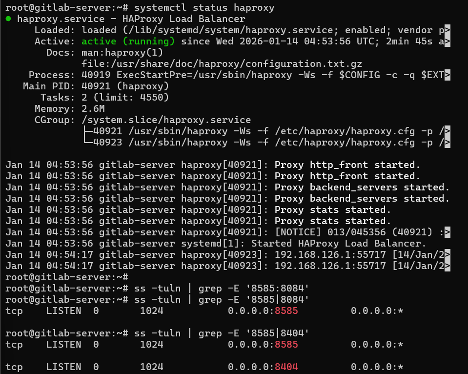

# Ansible Lab: Applying HAProxy Load Balancer

- Using the setup from Step 10, deploy HAProxy with Ansible to act as a load balancer in front of the backend services.

- Verify that the load balancer is functioning correctly by sending multiple requests and confirming that traffic is distributed across multiple backend servers.

- Take screenshots as proof that load balancing is successfully applied.

